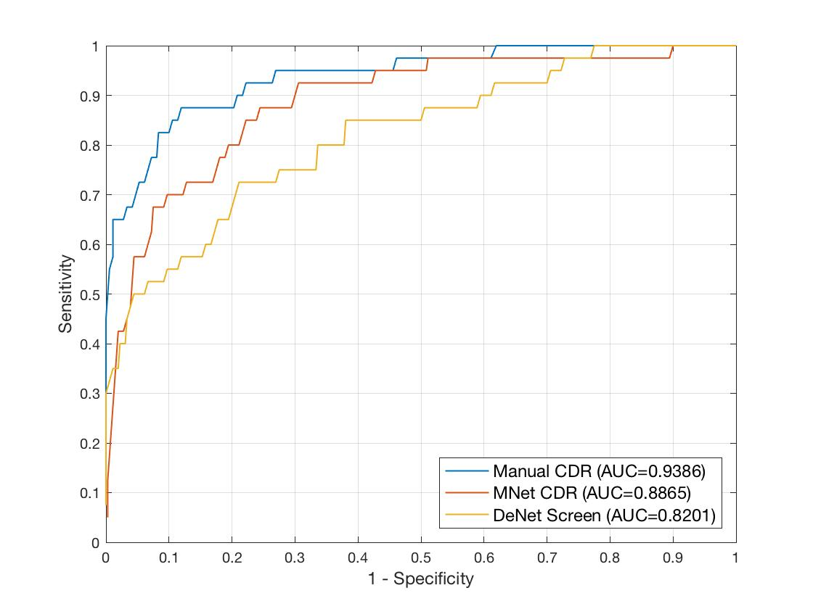

# REFUGE_baseline
The baseline performances for Retinal Fundus Glaucoma Challenge

Introduction:
-------------

Retinal Fundus Glaucoma Challenge (REFUGE) is organized as a half day Challenge in conjunction with the 5th MICCAI Workshop on Ophthalmic Medical Image Analysis (OMIA), a Satellite Event of the MICCAI 2018 conference in Granada, Spain. ([[link]](https://refuge.grand-challenge.org/home/))

In this project, we provide performances of the following baseline methods:

1. Multi-label Deep Network (MNet) [1]: [[Code link]](https://github.com/HzFu/MNet_DeepCDR)
2. Disc-aware Ensemble Network (DENet) [2]: [[Code link]](https://github.com/HzFu/DENet_GlaucomaScreen)

Details:
----------------

1. MNet and DENEt are trained on ORIGA dataset (650 disc center fundus images with size 3072 × 2048).
2. Since the image in ORIGA dataset is the disc center, the size 800 × 800 is suitable. However, for REFUGE Challenge, the image is macular center, and the black background outside the fundus view will disturb the MNet. Base on this issue, we change the crop disc ROI to size 600 × 600 ("DiscROI_size" in Code).

Evaluation on Training Data:
----------------------------------
We evaluate the baselines on training data, i.e., 400 Zeiss Visucam images (2124×2056 pixels). **Note that we load the model parameters of MNet and DENet trained on ORIGA dataset directly without any fine-tuning.**

**Segmentation Result:** 

By IOU score.

|    |  Disc  |  Cup  |  Avg. |
| ---------- | --- |  ---  |  ---  |
| MNet  |   0.7090 | 0.8628 | 0.7859 |

**Glaucoma Screening Result:** 

By ROC and AUC score.

Manual CDR is calculated by groundtruth of disc and cup.

Evaluation on Validation Data:
----------------------------------

We evaluate the baselines on validation data, i.e., 400 Canon CR-2 images (1634×1634 pixels). **Note that we load the model parameters of MNet and DENet trained on ORIGA dataset directly without any fine-tuning.**

**Segmentation Result:**

**Glaucoma Screening Result:**

References:
---------------

[1] Huazhu Fu, Jun Cheng, Yanwu Xu, Damon Wing Kee Wong, Jiang Liu, Xiaochun Cao, "Joint Optic Disc and Cup Segmentation Based on Multi-label Deep Network and Polar Transformation", IEEE Transactions on Medical Imaging (TMI), vol. 37, no. 7, pp. 1597-1605, 2018.

[2] Huazhu Fu, Jun Cheng, Yanwu Xu, Changqing Zhang, Damon Wing Kee Wong, Jiang Liu, Xiaochun Cao, "Disc-aware Ensemble Network for Glaucoma Screening from Fundus Image", IEEE Transactions on Medical Imaging (TMI), 2018. In press. (DOI: 10.1109/TMI.2018.2837012)

